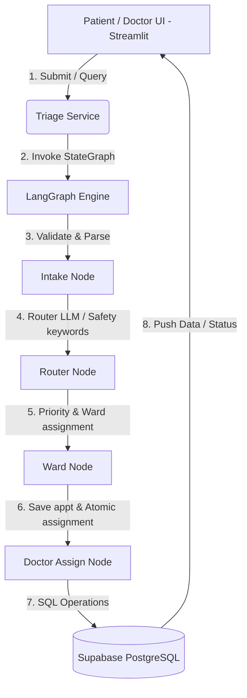

# System Architecture Document — MediTriage

## 1. System Topology & Data Flow
MediTriage is designed as a reactive, multi-tier Python web application powered by Streamlit, orchestrated by LangGraph, and backed by Supabase (PostgreSQL).



### Flow Breakdown:
1.  **User Input:** The patient inputs query information (symptoms, age, name, gender) via Streamlit.
2.  **Service Invocation:** `triage_service.run_triage(form_data)` builds the initial state and invokes the Compiled StateGraph.
3.  **Intake Node:** Cleans input, validates mandatory fields, and parses the age string.
4.  **Router Node:** Queries the Groq API (`llama-3.3-70b-versatile`) to classify the patient's symptoms into one of the designated wards. Safety-net keyword matching runs first as a fallback to ensure immediate emergency classification.
5.  **Ward Node:** Analyzes the target ward and queries to set patient priority (`high` or `normal`).
6.  **Doctor Assign Node:** Connects to Supabase. Inserts the appointment in a `waiting` state, then attempts to query available doctors. Performs an atomic SQL update statement on a free doctor. If successful, shifts doctor state to `busy` and updates the appointment status to `in_progress`. If unsuccessful, calculates the queue position.
7.  **Dashboard Update:** Streamlit updates views and outputs the results to the user.

---

## 2. Directory Structure
```
Hospital Agent/
│
├── .streamlit/                 # Streamlit configuration directory
│   └── secrets.toml            # Credentials (API keys, DB connection strings)
│
├── agent/                      # LangGraph core workflow logic
│   ├── __init__.py
│   ├── graph.py                # StateGraph declaration & compilation
│   ├── nodes.py                # Graph nodes logic (intake, router, ward, doctor_assign)
│   ├── prompts.py              # LLM system prompts (age parser, ward classifier)
│   └── state.py                # TypedDict representing graph state schema
│
├── database/                   # Database client & SQL schemas
│   ├── __init__.py
│   ├── client.py               # Supabase client singleton setup
│   ├── schema.sql              # Supabase tables and Row Level Security definitions
│   └── seed.py                 # CSV parsing and DB seeding script
│
├── services/                   # Business logic layers
│   ├── __init__.py
│   ├── appointment_service.py  # Appointments CRUD, queuing, notes, and completions
│   ├── doctor_service.py       # Doctor lookups, status updates, and audit logging
│   └── triage_service.py       # Entrypoint interface for Streamlit patient intake
│
├── views/                      # UI view routers for Streamlit layout separation
│   ├── __init__.py
│   ├── doctor_view.py          # Dashboard stub for doctors
│   └── patient_view.py         # Dashboard stub for patients
│
├── .env                        # Local environment credentials (DB & Groq keys)
├── .gitignore
├── app.py                      # Main application entry point, routing, and UI rendering
├── config.py                   # Central constants, keyword lists, and config variables
├── doctors.csv                 # Seed data file containing doctor shifts and rosters
├── requirements.txt            # Project backend dependencies
└── requirements_frontend.txt   # Streamlit dependencies
```

---

## 3. Database Schema Design (Supabase PostgreSQL)
The database structure is designed to guarantee consistency, fast queries, and auditability.

```mermaid
erDiagram
    doctors ||--o{ appointments : "assigned_doctor_id"
    doctors ||--o{ status_log : "doctor_id"

    doctors {
        uuid doctor_id PK
        text name UNIQUE
        text ward "emergency | mental_health | general"
        text specialization
        text status "free | busy | on_leave"
        time shift_start
        time shift_end
        timestamptz created_at
    }

    appointments {
        uuid id PK
        text patient_name
        integer age
        text gender
        text query
        text ward "emergency | mental_health | general"
        text reasoning
        uuid assigned_doctor_id FK
        text priority "high | normal"
        text status "waiting | in_progress | done"
        text notes
        timestamptz created_at
    }

    status_log {
        uuid id PK
        uuid doctor_id FK
        text old_status
        text new_status
        text changed_by
        timestamptz timestamp
    }
```

### Key Performance and Safety Structures:
*   **Atomic Updates:** Doctor assignment prevents race conditions using conditional updates:
    ```sql
    UPDATE doctors 
    SET status = 'busy' 
    WHERE doctor_id = :id AND status = 'free';
    ```
*   **Indexes:** Optimized indexes exist on:
    *   `idx_doctors_ward_status` for swift queries of available staff.
    *   `idx_appointments_ward_status_priority` for instant sorting of active wait queues (FIFO within priority).

---

## 4. Technical Stack
*   **Application Framework:** Streamlit (v1.30+)
*   **Orchestration Engine:** LangGraph (v0.0.10+)
*   **LLM Provider:** Groq Cloud SDK (`llama-3.3-70b-versatile`)
*   **Database & Auth Provider:** Supabase Cloud Core API (Python SDK v2.0+)
*   **Environment & Secrets:** Streamlit secrets manager (`secrets.toml`) and `.env` fallback support.
